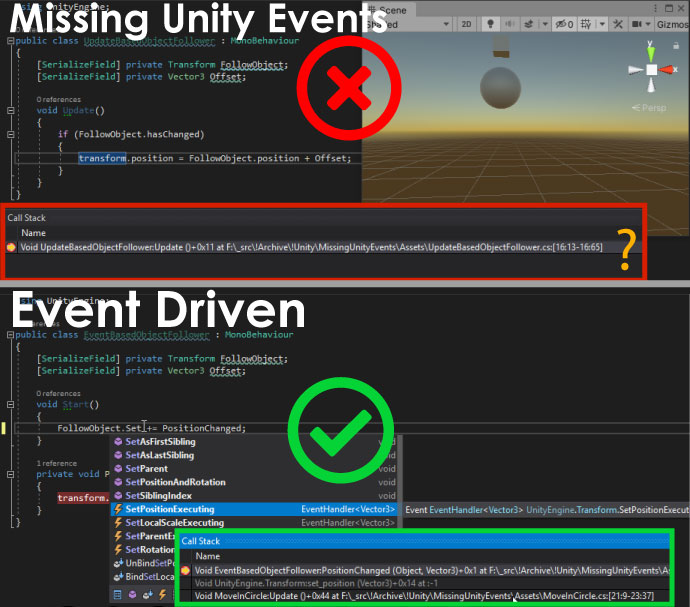
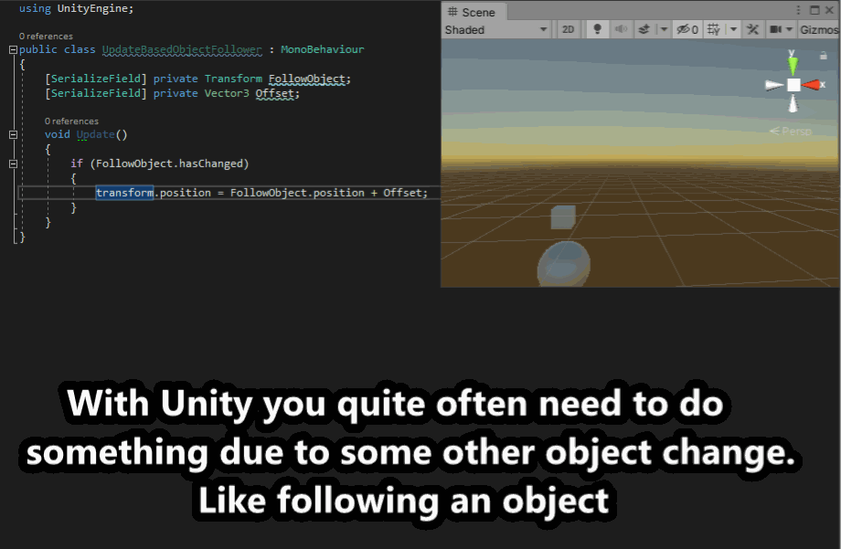
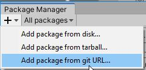

# Missing Unity Events

If you were ever looking for a way to write more event driven code in Unity you probably found that it's not so easy at least not with some very basic structures like `Transforms`. 

To get it working you probably needed to abstract some parts of API and provide events there which would require buy-in from other devs as well as your own self-discipline to be properly used.

Events directly in property setters come in handy in some situations:
- Debugging a sneaky `Transform` that changes position/rotation/scale and you have no idea why
    - could be even worse if it's down to some third party plugin that modifies it in which case it gets even tricier
- Writing more event driven code that's not tied to update

Unfortunately those are simply not there, if you want to respond to some changes you'll likely going to use `Update` loop of some game object.

> # Making this tool better
> I'm working on a visual transform debugger, that'll make this tool to be incredibly simple to use and will add more features. I need your help if you got 4 minutes to spare.
> In following link https://forms.gle/SE6As64EZjTGGZHH7 there's a short video that shows POC and 2 questions to answer. Please have a look!

# Adding Events back to Unity APIs
This tool can add those events to Unity DLLs enabling you to use them as you would any other events. It's very straight forward to use and works globally, which means once you've added them they'll stay there.



## Approach
Tool uses `IL Weaving` and will add specified `Events` directly to Unity DLLs, both for `Editor` and `Builds`. These are standard events, nothing different from writing them out by hand. Usage and performance will be in line with what you'd expect from manually created events. 

> **Since DLL IL code is modified you want to check with your Unity License if that's allowed. Tool and docs are provided for educational purposes. Tool can be found at https://github.com/handzlikchris/AddingEventsToCompiled3rdPartyLibrary**

## Usage

### Weaving Events into DLLs

1) Go to `Window -> Package Manager` and `'Add package from hit URL...'`



2) use url : 'https://github.com/handzlikchris/Unity.MissingUnityEvents.git'
3) Click on the `Missing Unity Events` menu bar followed by `Run`
4) Pick weaver executable in via `Pick` next to `Plugin Executable Path` - it should alredy open in correct folder (if not it'll be located int the `Plugin~` folder, eg `<YourLocalPath>/MissingUnityEvents/Assets/Plugins/MissingUnityEvents/Editor/Plugins~/EventILWeaver.Console.exe`)
5) Specify types that you want to add events to
    - once you type in valid type `PropertyName` dropdown will allow you to choose from likely supported properties
6) Click `Weave Events to DLL`

### Generating helper classes
It's best to abstract usage of weaved events. This way if you're using clean dll you won't have to change your existing code, instead it'll just log warning if specified.

1) Click `Pick` next to `Helper Class File Path` and select the file that'll be used as a target for generated code
    - if it does not exist just create empty
2) Fill `Namespace` ideally this will be root namespace for your project, with that extensions method will be easily picked up
3) You can also specify `Custom Code When no Build Symbols` - this will be injected to method body when there build symbol is not defined (eg. DLLs were reverted and using new fields would result in error)

```
#if ILWeavedEventsOn
	public static class BoxColliderExtensions 
	{
		
		public static void BindSetSizeExecuting(this BoxCollider obj, EventHandler<Vector3> handler)
	    {
	        obj.SetSizeExecuting += handler;
	    }
    }
#else
	public static class BoxColliderExtensions 
	{
		
		public static void BindSetSizeExecuting(this BoxCollider obj, EventHandler<Vector3> handler)
	    {
	        <Your code will go in here>
	    }
    }
#endif
```

4) Click `Generate Helper Classes`

#### Using helper classes
From now on instead of using weaved `Events` eg. 
``` BoxCollider.SetSizeExecuting += (sender, args) => { <handler code> }; ```

You can use helper methods that'll not break your code with not modified DLLs
``` BoxCollider.BindSetSizeExecuting((sender, args) => { <handler code> }); ```

#### Force no build symbol
If you want to use helper classes with fallback code tick `Force no build symbol (in editor)` - this will turn the build symbol off (effectively turning off your binding). **The DLLs still has event fields in them**.

### Reverting to backup
If you want to completely remove changes made by plugin click `'Revert DLL to original'` this will restore backups.

### Emergency backup restore
In some cases changes made to DLLs will cause editor to crash. As example if you try to add event to `Object.name`. Potentially more types / properties will cause this issue, if that happens there's a rollback script created `revert-last-weaving.bat` in the same folder as plugin. Running it will revert to backups. 